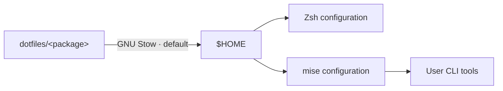

<h1 align="center">dotfiles</h1>

<p align="center">
  Personal Gentoo configuration for GNOME, Zsh, Neovim, and CLI tooling.
</p>

<p align="center">
  <a href="https://www.gentoo.org/"></a>
  <a href="https://www.gnu.org/software/stow/"></a>
  <a href="https://catppuccin.com/"></a>
</p>

<p align="center">
  <a href="#quick-start">Quick start</a> ·
  <a href="#package-map">Packages</a> ·
  <a href="#maintenance">Maintenance</a> ·
  <a href="#known-constraints">Known constraints</a>
</p>

## What this is

This repository describes one Linux workstation. It is a collection of small
[GNU Stow](https://www.gnu.org/software/stow/) packages, not a universal
installer. Packages can be inspected, simulated, and deployed independently.

| Layer        | Current choice                                                              |
| ------------ | --------------------------------------------------------------------------- |
| Distribution | Gentoo Linux                                                                |
| Desktop      | GNOME on Wayland                                                            |
| Shell        | Zsh, Zi, Powerlevel10k, F-Sy-H                                              |
| CLI tools    | Portage for runtimes; [mise](https://mise.jdx.dev/) for user-level binaries |
| Editor       | [Neovim 0.12.4+](https://github.com/jczhang02/nvim) as a submodule          |
| Palette      | Catppuccin Latte; Ghostty follows the system light/dark theme               |

Many files contain host-specific paths, hardware identifiers, and service
settings. Treat the repository as a reference unless the target is the same
machine.

## How deployment works



Stow manages configuration files and symbolic links. mise installs and selects
user-level CLI tools; it does not replace Portage for system programs or
language runtimes. The repository does not add another bootstrap layer around
either tool.

The checked-in `.stowrc` targets `$HOME`, enables `--no-folding`, and ignores
`node_modules` plus Neovim's local `.ruff_cache`. With `--no-folding`, Stow
creates or reuses ordinary parent directories and links tracked files into them
instead of linking a whole directory at once. It does not manage files generated
later by applications. Every current package targets `$HOME`; root-owned system
configuration intentionally stays outside this repository.

## Quick start

### Prerequisites

Make these commands available through Portage before deploying the repository:

| Purpose                  | Required commands                   |
| ------------------------ | ----------------------------------- |
| Repository bootstrap     | `git`, `stow`, `zsh`, `mise`        |
| Configured mise backends | `bun`, `go`, `cargo`, `rustc`, `uv` |
| Credentials and access   | `ssh`, `gpg`, `gh`                  |

The complete configured toolset has been tested with mise 2026.7.5. That is a
tested version, not a claim about the minimum supported version.

### Shell

The shell setup does not require any submodules:

```bash
git clone https://github.com/jczhang02/dotfiles.git ~/dev/dotfiles
cd ~/dev/dotfiles

stow --simulate --verbose zsh mise f-sy-h
stow zsh mise f-sy-h

git clone --depth=1 https://github.com/z-shell/zi.git \
  "${XDG_DATA_HOME:-$HOME/.local/share}/zi/bin"

exec zsh
```

Install one declared CLI when it is needed, or install the complete configured
toolset:

```bash
mise install npm:prettier
mise install
```

Deploy any other user package with the same dry-run-first workflow:

```bash
stow --simulate --verbose git ghostty bat
stow git ghostty bat
```

Yazi uses its official package manager for five plugins and the Catppuccin
Latte flavor. Stow links the tracked files into an ordinary live configuration
directory, where `ya pkg` can keep downloaded package contents local:

```bash
stow --simulate --verbose yazi
stow yazi
ya pkg install
```

oh-my-tmux remains an upstream checkout; this repository owns the local overlay
and one reusable tmuxp workspace template. On a new machine, install the
official configuration before deploying them:

```bash
tmux_config_dir="${XDG_CONFIG_HOME:-$HOME/.config}/tmux"
install -d "$tmux_config_dir"
git clone --depth=1 https://github.com/gpakosz/.tmux.git \
  "$tmux_config_dir/.tmux"
ln -s .tmux/.tmux.conf "$tmux_config_dir/tmux.conf"

stow --simulate --verbose tmux
stow tmux
```

Create private SSH and GnuPG directories before their first deployment so they
start with the correct permissions. Stow then links only the tracked
configuration files into these ordinary directories:

```bash
install -d -m 700 "$HOME/.ssh" "$HOME/.gnupg"
stow --simulate --verbose ssh gnupg
stow ssh gnupg
```

Private keys are intentionally absent from this repository. On a new machine,
restore the SSH keys from an encrypted backup, import the GPG signing key, and
authenticate GitHub before deploying the Git package:

```bash
gpg --import /secure/path/to/signing-key.asc
gpg --list-secret-keys
gh auth login

stow --simulate --verbose git
stow git
```

## Package map

There are 33 Stow packages in the current tree.

| Area               | Packages                                                                                       |
| ------------------ | ---------------------------------------------------------------------------------------------- |
| Desktop            | `X11`, `gtk`, `fontconfig`, `fcitx`                                                            |
| Shell and terminal | `zsh`, `bash`, `f-sy-h`, `ghostty`, `kitty`, `tmux`, `bat`, `eza`, `yazi`, `zathura`, `direnv` |
| Editors and agents | `nvim`, `claude`                                                                               |
| Development        | `git`, `ssh`, `gnupg`, `mise`, `go`, `conda`, `npm`, `pnpm`, `latexmk`                         |
| Apps and media     | `mpv`                                                                                          |
| User system        | `pipewire`, `containers`, `lxc`, `xdg`, `btop`, `eix`                                          |

Notable package boundaries:

- `X11` contains `.Xresources`, `.xprofile`, and `.xsession`.
- `mpv` uses one native configuration file with the built-in UI and keymap; the
  rationale is recorded in [MPV-RESEARCH.md](MPV-RESEARCH.md).
- `xdg` deploys only the stable portal selection. GNOME keeps the dynamic
  default-application and user-directory files as ordinary local files.
- `nvim` tracks `jczhang02/nvim` on `main` and is the only submodule.
- `f-sy-h` vendors the four Catppuccin syntax-highlighting themes and their
  license.
- `gig-cli` is installed by mise from
  [jczhang02/gig](https://github.com/jczhang02/gig) at a pinned Git revision;
  it no longer depends on a local linked build.
- `yazi` tracks configuration and `package.toml`; `ya pkg` installs its five
  plugins and Catppuccin Latte flavor into the live configuration directory.
- `tmux` tracks the oh-my-tmux overlay and a parameterized `tmuxp` workspace;
  project-specific or retired workspaces stay local.

## Design principles

- Keep Stow responsible only for configuration deployment.
- Keep root-owned system configuration outside this repository.
- Let Portage own system programs and runtimes; let mise own user-level global
  CLI tools.
- Install declared mise tools only when they are needed.
- Prefer XDG locations unless an application requires a traditional path.
- Keep machine-local overrides outside the repository when practical.
- Use Catppuccin Latte as the primary light palette without forcing every
  application to ignore the system theme.

## Project environments

direnv only activates an environment; it does not initialize projects or
install dependencies.

| Project type | `.envrc` entry               | Explicit setup command |
| ------------ | ---------------------------- | ---------------------- |
| uv           | `source .venv/bin/activate`  | `uv sync`              |
| Mamba        | `layout mamba <environment>` | `mamba create ...`     |

Run `direnv allow` after reviewing the project-local `.envrc`. The small Mamba
layout adapter exists because Mamba 2.5 is not compatible with direnv's older
built-in Conda activation command; it sets the same `MAMBA_ROOT_PREFIX` as the
Zsh setup. With no separate `envs_dirs` or `pkgs_dirs` overrides, environments
and the primary package cache follow that XDG root.

## Maintenance

```bash
# Inspect, redeploy, or remove one package
stow --simulate --verbose zsh
stow --restow zsh
stow --delete zsh

# Reconcile or upgrade installed CLI tools
mise install
mise upgrade
```

Run syntax and application-specific checks before committing. In particular,
Zsh files can be parsed with `zsh -n`, shell scripts with `shellcheck`, and the
Neovim submodule has its own documented local checks.

## Known constraints

> [!NOTE]
> Neovim is the only remaining submodule and uses a public HTTPS URL. Initialize
> it explicitly when needed instead of using a recursive clone:
>
> ```bash
> git submodule update --init nvim/.config/nvim
> ```

- The Tmux overlay installs
  [`jczhang02/tmux-autoname`](https://github.com/jczhang02/tmux-autoname)
  through the built-in TPM integration. LLM naming remains opt-in in the
  plugin's private local configuration.
- One administrator cleanup remains outside this repository: uninstall the
  system `net-misc/aliyunpan` package. Its dotfiles are already gone, but
  `/usr/bin/aliyunpan` is still installed by Portage.

## Reuse

This repository does not currently declare a repository-wide license.
Third-party material remains subject to its upstream terms; verify the relevant
source before reuse. Major bundled themes and derived configuration are mapped
in [THIRD_PARTY_LICENSES.md](THIRD_PARTY_LICENSES.md).
