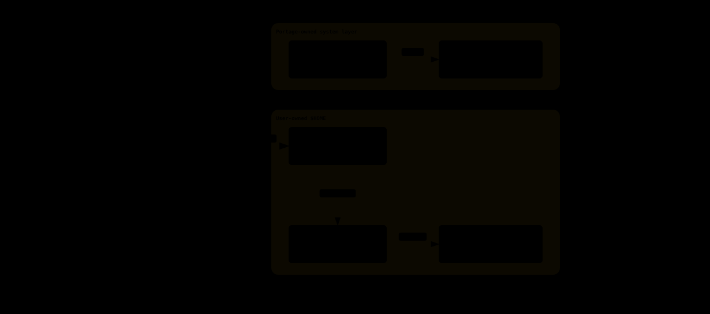

<h1 align="center">dotfiles</h1>

<p align="center">
  Personal Gentoo configuration for GNOME, Zsh, Neovim, and CLI tooling.
</p>

<p align="center">
  <a href="https://www.gentoo.org/"></a>
  <a href="https://www.gnu.org/software/stow/"></a>
  <a href="https://catppuccin.com/"></a>
</p>

<p align="center">
  <a href="#quick-start">Quick start</a> ·
  <a href="#package-map">Packages</a> ·
  <a href="#maintenance">Maintenance</a> ·
  <a href="#known-constraints">Known constraints</a>
</p>

## What this is

This repository describes one Linux workstation. It is a collection of small
[GNU Stow](https://www.gnu.org/software/stow/) packages, not a universal
installer. Packages can be inspected, simulated, and deployed independently.

| Layer        | Current choice                                                              |
| ------------ | --------------------------------------------------------------------------- |
| Distribution | Gentoo Linux                                                                |
| Desktop      | GNOME on Wayland                                                            |
| Shell        | Zsh, Zi, Powerlevel10k, F-Sy-H                                              |
| CLI tools    | Portage for runtimes; [mise](https://mise.jdx.dev/) for user-level binaries |
| Editor       | [Neovim 0.12.4+](https://github.com/jczhang02/nvim) as a submodule          |
| Palette      | Catppuccin Latte; Ghostty follows the system light/dark theme               |

Many files contain host-specific paths, hardware identifiers, and service
settings. Treat the repository as a reference unless the target is the same
machine.

## How deployment works

<p align="center">
  
</p>

<p align="center">
  <sub>Open the <a href="docs/architecture/dotfiles-deployment.html">interactive diagram</a> locally for theme switching and image export.</sub>
</p>

Stow manages configuration files and symbolic links. mise installs and selects
user-level CLI tools; it does not replace Portage for system programs or
language runtimes. The repository does not add another bootstrap layer around
either tool.

The checked-in `.stowrc` targets `$HOME`, enables `--no-folding`, and ignores
`node_modules` plus Neovim's local `.ruff_cache`. With `--no-folding`, Stow
creates or reuses ordinary parent directories and links tracked files into them
instead of linking a whole directory at once. It does not manage files generated
later by applications. Every current package targets `$HOME`; root-owned system
configuration intentionally stays outside this repository.

## Quick start

A new machine is set up in six ordered steps. Every Stow command can be
previewed first with `stow --simulate --verbose`.

### 1. System packages

System programs and fonts that the configuration expects are listed in one
Portage set, [`system/portage/sets/dotfiles`](system/portage/sets/dotfiles).
Some come from overlays, so enable those first:

```bash
sudo eselect repository enable guru gentoo-zh jaredallard
sudo eselect repository add jc git https://github.com/jczhang02/jc_overlay.git
sudo emaint sync -r guru -r gentoo-zh -r jaredallard -r jc

sudo emerge --noreplace dev-vcs/git
git clone https://github.com/jczhang02/dotfiles.git ~/dev/dotfiles
cd ~/dev/dotfiles

sudo install -Dm644 system/portage/sets/dotfiles /etc/portage/sets/dotfiles
sudo emerge -av @dotfiles
```

`system/` is not a Stow package. Portage reads the set from `/etc`, so copy it
again after editing it. User-level CLIs are declared in `mise/` instead.

### 2. Keys and credentials

Private keys are intentionally absent from this repository. Create the private
directories with the right permissions, restore the SSH keys from an encrypted
backup, import the GPG signing key, and authenticate GitHub:

```bash
install -d -m 700 "$HOME/.ssh" "$HOME/.gnupg"
gpg --import /secure/path/to/signing-key.asc
gh auth login
```

### 3. Upstream checkouts

oh-my-tmux, Zi, and the Neovim configuration are upstream checkouts that the
tracked files build on:

```bash
tmux_config_dir="${XDG_CONFIG_HOME:-$HOME/.config}/tmux"
install -d "$tmux_config_dir"
git clone --depth=1 https://github.com/gpakosz/.tmux.git "$tmux_config_dir/.tmux"
ln -s .tmux/.tmux.conf "$tmux_config_dir/tmux.conf"

git clone --depth=1 https://github.com/z-shell/zi.git \
  "${XDG_DATA_HOME:-$HOME/.local/share}/zi/bin"

git -C ~/dev/dotfiles submodule update --init nvim/.config/nvim
```

### 4. Deploy every package

```bash
cd ~/dev/dotfiles
packages=$(ls -d */ | grep -vxE 'docs/|system/' | tr -d /)
stow --simulate --verbose $packages
stow $packages
```

### 5. Per-package follow-up

```bash
mise install        # user-level CLIs declared in mise/
skills-restore      # third-party agent skills from the tracked lock
ya pkg install      # Yazi plugins and flavor
fc-cache -f         # fonts from @dotfiles and the hand-installed sets below
```

- Copy the hand-installed font sets listed under
  [Known constraints](#known-constraints) into `~/.local/share/fonts`.
- Install `cua-driver` with its own installer.
- tmux installs its plugins through oh-my-tmux's TPM integration on first start.

The complete configured mise toolset has been tested with mise 2026.7.5. That is
a tested version, not a claim about the minimum supported version.

### 6. Log in again

`environment.d`, fcitx, and GNOME Shell pick up their settings only in a new
session. After logging back in, enable the tracked extension:

```bash
gnome-extensions enable gsconnect-screenshot-share@local
```

## Package map

`docs/` and `system/` are not Stow packages.

| Area               | Packages                                                                                               |
| ------------------ | ------------------------------------------------------------------------------------------------------ |
| Desktop            | `gtk`, `fontconfig`, `fcitx`, `gnome-shell`                                                            |
| Shell and terminal | `zsh`, `bash`, `f-sy-h`, `ghostty`, `tmux`, `sesh`, `bat`, `eza`, `yazi`, `zathura`, `direnv`           |
| Editors and agents | `nvim`, `claude`, `agents`                                                                             |
| Development        | `git`, `ssh`, `gnupg`, `mise`, `go`, `conda`, `npm`, `pnpm`, `latexmk`                                 |
| Apps and media     | `mpv`                                                                                                  |
| User system        | `containers`, `xdg`, `btop`, `eix`                                                                     |

Notable package boundaries:

- `mpv` uses one native configuration file with the built-in UI and keymap.
- `xdg` deploys the stable portal selection and hand-written `environment.d`
  files. GNOME keeps the dynamic default-application and user-directory files
  as ordinary local files.
- `gtk` leaves `bookmarks` local since file managers rewrite it at runtime.
- `claude` tracks only hand-written Claude Code files: `CLAUDE.md`, subagents,
  keybindings, themes, and the `pi-session-name` hook. `settings.json` stays
  local because Claude Code replaces it on every settings change; the herdr hook
  is owned by herdr.
- `agents` tracks the global `npx skills` lock, `rules/`, and self-authored
  skills. `skills-restore` reinstalls third-party skills from the lock;
  `jc-writing-style/references/` stays local, and tool-installed skills
  (`plannotator*`, `beads`, `cua-driver`) are left to their installers.
- `gnome-shell` tracks the self-authored GSConnect screenshot-share extension
  and the `gsconnect-send-file` helper it calls by path.
- `nvim` tracks `jczhang02/nvim` on `main` and is the only submodule.
- `f-sy-h` vendors the four Catppuccin syntax-highlighting themes and their
  license.
- `gig-cli` is installed by mise from
  [jczhang02/gig](https://github.com/jczhang02/gig) at a pinned Git revision;
  it no longer depends on a local linked build.
- `yazi` tracks configuration and `package.toml`; `ya pkg` installs its five
  plugins and Catppuccin Latte flavor into the live configuration directory.
- `sesh` tracks `sesh.toml` and `sesh-pick`, the fzf session picker shared by
  the zsh startup prompt and tmux `prefix s`.
- `tmux` tracks the oh-my-tmux overlay and a parameterized `tmuxp` workspace;
  project-specific or retired workspaces stay local.

## Design principles

- Keep Stow responsible only for configuration deployment.
- Keep root-owned system configuration outside this repository.
- Let Portage own system programs and runtimes; let mise own user-level global
  CLI tools.
- Install declared mise tools only when they are needed.
- Prefer XDG locations unless an application requires a traditional path.
- Keep machine-local overrides outside the repository when practical.
- Track only files that people edit by hand; files an application rewrites on
  its own stay local.
- Keep `~/.local/bin` free of loose binaries: Portage and mise install
  programs, and Stow links only self-authored scripts.
- Use Catppuccin Latte as the primary light palette without forcing every
  application to ignore the system theme.

## Project environments

direnv only activates an environment; it does not initialize projects or
install dependencies.

| Project type | `.envrc` entry               | Explicit setup command |
| ------------ | ---------------------------- | ---------------------- |
| uv           | `source .venv/bin/activate`  | `uv sync`              |
| Mamba        | `layout mamba <environment>` | `mamba create ...`     |

Run `direnv allow` after reviewing the project-local `.envrc`. The small Mamba
layout adapter exists because Mamba 2.5 is not compatible with direnv's older
built-in Conda activation command; it sets the same `MAMBA_ROOT_PREFIX` as the
Zsh setup. With no separate `envs_dirs` or `pkgs_dirs` overrides, environments
and the primary package cache follow that XDG root.

## Maintenance

```bash
# Inspect, redeploy, or remove one package
stow --simulate --verbose zsh
stow --restow zsh
stow --delete zsh

# Reconcile or upgrade installed CLI tools
mise install
mise upgrade
```

Run syntax and application-specific checks before committing. In particular,
Zsh files can be parsed with `zsh -n`, shell scripts with `shellcheck`, and the
Neovim submodule has its own documented local checks.

## Known constraints

> [!NOTE]
> Neovim is the only remaining submodule and uses a public HTTPS URL. Initialize
> it explicitly when needed instead of using a recursive clone:
>
> ```bash
> git submodule update --init nvim/.config/nvim
> ```

- The Tmux overlay installs
  [`jczhang02/tmux-autoname`](https://github.com/jczhang02/tmux-autoname)
  through the built-in TPM integration. LLM naming remains opt-in in the
  plugin's private local configuration.
- `cua-driver` is the one CLI installed outside Portage and mise; its own
  installer manages `~/.cua-driver` and the `~/.local/bin/cua-driver` link.
- Two font sets are hand-installed in `~/.local/share/fonts` and must be copied
  to a new machine: Microsoft fonts (`microsoft_cn`, `microsoft_en`) and the
  `kami` typesetting fonts (TsangerJinKai, Source Han Serif KR) that the kami
  skill expects. Every other font comes from `@dotfiles`.
- `/tmp` is a ZFS dataset (`rpool/tmp`, `mountpoint=legacy`, 64G quota,
  `sync=disabled`) instead of tmpfs, so files that agents and their build jobs
  leave in `/tmp` no longer pin RAM and swap. A `tmp.mount` drop-in in
  `/etc/systemd/system/tmp.mount.d/` points the stock unit at the dataset, and
  `/etc/tmpfiles.d/tmp.conf` keeps the tmpfs semantics of clearing `/tmp` at
  boot. Both files are root-owned and stay outside this repository.

## Reuse

This repository does not declare a license. Bundled Catppuccin themes and the
oh-my-tmux overlay come from their upstream projects and remain under those
projects' terms.
